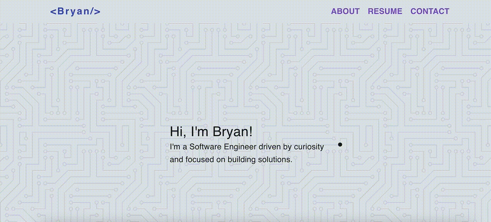

<!--
### A little bit about me...
- I'm learning 
- 
-->
<h1 align="center">Projects</h1>
<table border-color="#66b2b2">
  <tr>
    <td width="50%" valign="top">
      <h3 align="center">E-Comm</h3>
         
        
                
        

          <strong>Javascript, Material UI & Strapi</strong>
         
           Still cooking this one up...
            
          But get your flowers here people.
        
        
    </td>
    <td width="50%" valign="top">
      <h3 align="center">My Site</h3>
         
        
                
        

          <strong>React & Material UI</strong>
            Just a simple site for myself. 
        
        
    </td></tr>
    <tr>
      <td width="50%">
      <h3 align="center">Journald</h3>
         
        
                
        

          <strong>React, Node, Postgres & Material UI </strong>
         
          I am currently on a journey of improving my mental health. Journaling has been a helpful tool in the process and I'm working on this to make it convenient. I'm not fully sure where I'm going with this, but maybe ChatGPT can be my supplemental therapist here. (Joking, but not joking)
        
        
    </td>      
    </tr>

  </table>
